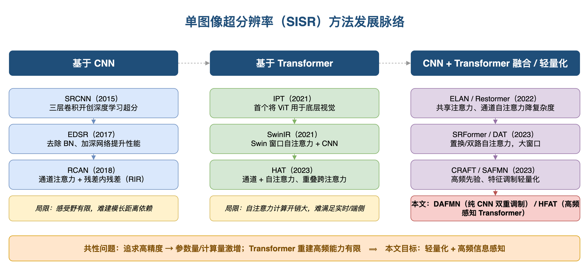

# Academic Arsenal

> 学术写作全家桶 —— 一个 Claude Code 插件,从你的论文生成图表、PPT 和学位论文。

[](LICENSE)
[](https://claude.ai/claude-code)

## 能做什么

```
📄 你的论文 + 笔记
        │
        ▼
┌─────────────────────────────────────────┐
│         Academic Arsenal                 │
├──────────┬──────────┬───────────────────┤
│gen-diagram│gen-slides│    gen-thesis     │
│  .drawio │  .pptx   │  LaTeX / Word     │
└──────────┴──────────┴───────────────────┘
        │          │          │
        ▼          ▼          ▼
   矢量图表     可编辑PPT    可编译论文骨架
```

三个技能,一个插件。各自独立,也可组合使用:

| 技能 | 输入 | 输出 | 适用场景 |
|------|------|------|----------|
| **gen-diagram** | 描述/论文/代码 | `.drawio` XML | 架构图、流程图、分类树 |
| **gen-slides** | 论文 + 演示类型 | `.pptx` | 组会、开题、中期、答辩 |
| **gen-thesis** | 论文 + 模板 | LaTeX / `.docx` | 学位论文、开题报告、调研报告 |

## 效果展示

### gen-diagram 生成的图表示例



## 核心特性

- **学术诚信**: 绝不编造数据、结果或引用。缺失内容标记 `% TODO`。
- **真正可编辑**: `.pptx` 是真文本框(不是图片)、`.drawio` 是矢量(不是 PNG)、`.tex` 是源码(不是 PDF)。
- **跨平台图表**: `.drawio` 文件在 [diagrams.net](https://app.diagrams.net) 网页版即可打开,无需安装桌面软件。
- **模板可扩展**: 贡献你学校的 LaTeX 模板,所有人都能用。
- **技能可组合**: gen-slides 和 gen-thesis 发现图片不清晰时,自动调用 gen-diagram 重绘。

## 安装

### 前置条件

- 已安装 [Claude Code](https://docs.anthropic.com/en/docs/claude-code)（Anthropic 官方 CLI 工具）

### 第一步：安装插件

**方式一：通过 Claude Code 插件市场安装（推荐）**

在 Claude Code 中运行：

```
/install-plugin academic-arsenal
```

**方式二：手动克隆**

```bash
git clone https://github.com/zhao1s747/academic-arsenal.git ~/.claude/plugins/academic-arsenal
```

> 两种方式效果相同。Claude Code 启动时会自动扫描 `~/.claude/plugins/` 下的插件并注册其中的 skill。

### 第二步：验证安装

打开 Claude Code，输入 `/` 查看可用的 skill 列表，你应该能看到：

- `/gen-diagram` — 生成 draw.io 图表
- `/gen-slides` — 生成 PPT
- `/gen-thesis` — 生成论文/报告

### 第三步：安装运行依赖（按需）

skill 在运行时会自动检测并提示你安装缺失的依赖，你也可以提前装好：

```bash
# 生成 PPT / Word 需要
pip install python-pptx python-docx

# 生成论文需要 LaTeX 发行版（三选一）
# macOS:
brew install --cask mactex
# Windows: 安装 MiKTeX (https://miktex.org)
# Linux:
sudo apt install texlive-full
```

> draw.io 桌面版为可选项，仅在需要将 `.drawio` 导出为 PNG/PDF 时才需要。不安装也不影响生成 `.drawio` 文件（可在 [diagrams.net](https://app.diagrams.net) 网页版打开编辑）。

## 使用方法

### 生成图表

```
/gen-diagram "CNN超分辨率网络的架构图"
/gen-diagram --type taxonomy "超分辨率方法分类: 基于CNN、基于Transformer、基于GAN"
/gen-diagram ./我的论文.pdf --type pipeline
```

### 生成PPT

```
/gen-slides ./论文.pdf --type defense --logo ./校徽.png
/gen-slides ./paper1.tex ./paper2.tex --type seminar --lang zh
/gen-slides ./毕设项目/ --type midterm --colors "#1F4E79" "#2E75B6"
```

### 生成论文

```
/gen-thesis ./paper1.pdf ./paper2.pdf --template scut-master --type thesis
/gen-thesis ./论文.tex --type proposal --format word
/gen-thesis ./papers/ --type survey --lang en
```

## 演示类型

| 类型 | 页数 | 适用于 |
|------|------|--------|
| `seminar` | 8-12 | 组会汇报、论文分享 |
| `proposal` | 12-15 | 开题答辩 |
| `midterm` | 15-20 | 中期检查 |
| `defense` | 18-25 | 毕业答辩 |
| `group-project` | 8-15 | 课程大作业展示 |

## 参与贡献

最有价值的贡献方式:

- **添加你学校的 LaTeX 模板** → 参见 [docs/adding-templates.md](docs/adding-templates.md)
- **添加 PPT 主题** → 在 `templates/slides/` 新建 `.py` 主题文件
- **反馈问题** → 开 GitHub Issue 描述你的使用场景

详见 [docs/CONTRIBUTING.md](docs/CONTRIBUTING.md)。

## 许可证

[MIT](LICENSE)

---

[English](README.en.md)
